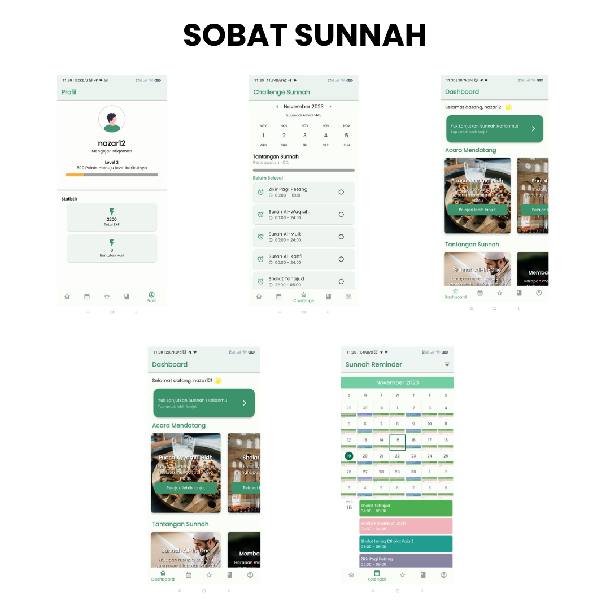

# Sobat Sunnah: Game Pengingat Sunnah Berbasis Mobile

Sobat Sunnah adalah sebuah aplikasi game yang dibangun menggunakan framework Flutter. Aplikasi ini bertujuan untuk menghidupkan Sunnah-Sunnah Rasulullah dengan sistem misi dan tantangan sebagai solusi inovatif.

## Deskripsi Proyek

Sobat Sunnah memiliki fokus untuk:
- Mengingatkan pengguna terhadap berbagai Sunnah Rasulullah.
- Menghadirkan pengalaman bermain game yang mendidik seputar Sunnah.
- Menyediakan fitur-fitur interaktif yang membuat belajar Sunnah lebih menyenangkan.

## Fitur Utama

1. **Tantangan Sunnah:**
   - Menyajikan tantangan harian atau mingguan berdasarkan Sunnah Rasulullah.
   - Memberikan reward atau penghargaan untuk setiap misi yang diselesaikan.

2. **Kalendar Sunnah:**
   - Menampilkan kalender khusus yang memperingati Sunnah-sunnah tertentu setiap harinya.
   - Memberikan informasi dan pengingat tentang Sunnah yang dapat dilakukan.

## Instalasi dan Penggunaan

1. **Prasyarat:**
   - Pastikan sudah terpasang Flutter SDK dan terhubung dengan platform yang akan digunakan (Android Studio/Xcode).

2. **Langkah-langkah:**
   - Clone repository ini ke dalam sistem lokal Anda.
   - Pastikan Anda telah mengatur lingkungan Flutter dengan menjalankan `flutter pub get` untuk mengunduh dependensi.
   - Jalankan aplikasi di emulator atau perangkat fisik menggunakan perintah `flutter run`.

## Kontribusi

Kami menyambut kontribusi dari siapa pun yang ingin berpartisipasi dalam pengembangan aplikasi ini. Silakan buka *pull request* dan kami akan meninjau dengan senang hati.

## Download Aplikasi

## Sreenshot Aplikasi
 

